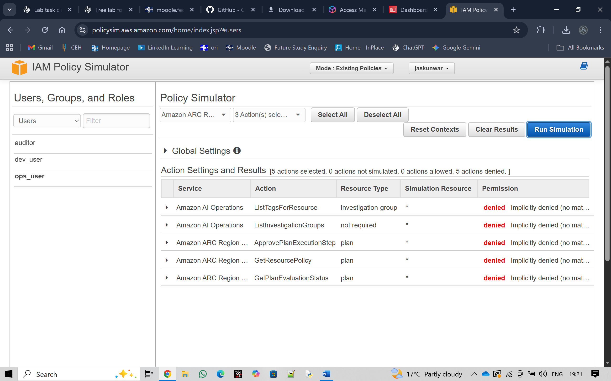

# AWS IAM Simulation & Least Privilege Lab

**Focus:** Cloud Security (Identity & Access Management)  
**Platform:** AWS  
**Tools:** AWS IAM Console · JSON Policies · MFA · CloudWatch  

---

##  Objectives
- Apply the **Principle of Least Privilege**.  
- Create and assign IAM roles (Developer · Operator · Auditor).  
- Enforce Multi-Factor Authentication (MFA).  
- Validate permissions through access-denied tests.

---

##  Methodology
1. Created three IAM users (`dev_user`, `ops_user`, `auditor`).  
2. Defined role-based JSON policies restricting each user’s scope.  
3. Enabled MFA for `ops_user` and `admin`.  
4. Tested privilege boundaries—unauthorized actions returned *Access Denied*.  
5. Documented results and screenshots.  
   - 

---

##  Results
- Each role restricted to its duties.  
- MFA successfully added an extra security layer.  
- Unauthorized actions blocked and logged in CloudWatch.  

---

##  Reflection
This lab strengthened my understanding of **least privilege** and **multi-factor security**.  
Seeing AWS deny unauthorized actions proved that properly crafted policies and MFA can mitigate account compromise risks.  
Next time, I plan to add CloudWatch alerting and automation for policy violations.

