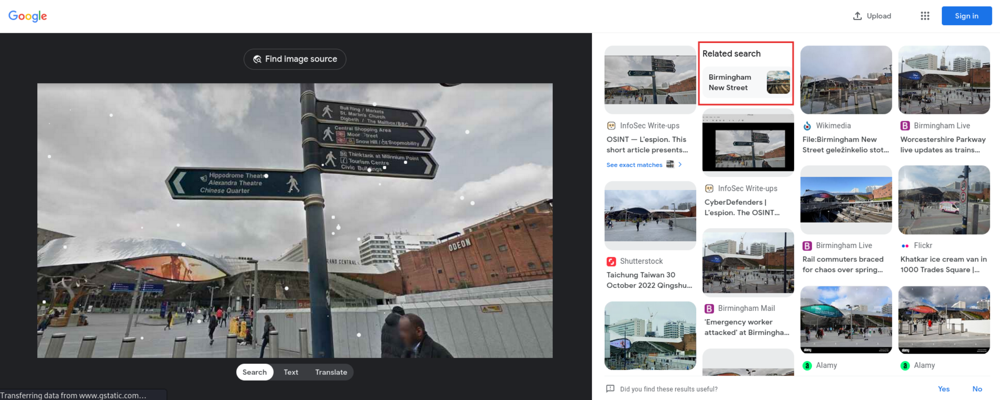

#  Lespion Insider Threat Investigation Lab

**Focus:** Insider Threat · OSINT · Digital Forensics  
**Platform:** CyberDefenders  
**Tools:** CyberChef · Sherlock · Google Lens · EXIF Tools  

---

##  Scenario
Acted as a SOC analyst investigating a suspected employee leaking credentials and running cryptomining software.  

---

##  Methodology
1. **Artifact Analysis** – reviewed `Github.txt`, `office.jpg`, `Webcam.png`.  
2. **GitHub Leak Detection** – decoded Base64 password → `PicassoBaguette99`.  
3. **OSINT Correlation** – used *Sherlock* to trace alias `EMarseille99`.  
4. **Image Forensics** – reverse searched images to identify possible locations.  
   -   
5. **Correlation** – linked online accounts and image metadata to the insider.

---

##  Results
- Identified insider’s GitHub leak with API keys and xmrig mining traces.  
- Confirmed malicious C2 activity via public repos.  
- Mapped identity across GitHub, Steam, Instagram.  

---

##  Reflection
This lab showed how **OSINT and forensics** combine to expose insider threats.  
It enhanced my critical-thinking skills and attention to evidence correlation.  
Next time I plan to document a clearer timeline and explore automated IOC correlation tools.

